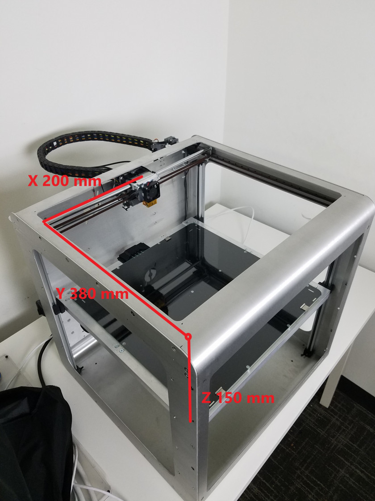
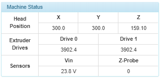

# Printer Coordinates

In your math classes you have probably heard the term: _Cartesian Coordinates_. This intimidating term is not as bad as it sounds. It refers to the 3D coordinate system that is used almost every where, including the Promega. It features three different axes \(X, Y and Z\), all perpendicular to each other, as seen in the image below. The origin of the cartesian system is located at the intersection of the three different coordinate axes. At this point, the X, Y and Z position are all zero.

In the case of the Promega, the cartesian coordinate frame is used to track the location of the nozzle. The nozzle can be considered a point that can be moved along the X, Y and Z axes in the printer. The nozzle is moved in the X and Y directions with a coreXY belt system and in the Z-direction with the z-platform. The orientation of the cartesian coordinate frame is not the same as in the image below. Look below to see the cartesian coordinate frame in the Promega.

**The Origin**

The origin of the Promega is located at the front-top-left corner of the printer, where the three red lines intersect. If the printer moves to X0, Y0 and Z0, or \(0,0,0\) it will end up in this corner. The position of the nozzle of the printer is measured from this point. As mentioned before, the printer moves in the X and Y direction with the a coreXY belt system, which we will go over later. The Z-axis works differently, instead of moving the nozzle away from the bed, the Promega moves the bed away from the nozzle. The nozzle is always located on a single plane which it can be moved across by the coreXY system. The Z-axis distance value increases as you move the bed **down**, away from the nozzle, and the distance decreases as you move the bed **up**, toward the nozzle. This might be counter-intuitive at first, as a normal oriented cartesian coordinate frame will have the Z-axis pointing up, but you will get used to it quickly.

**Coordinate Units**

The Promega 3D printer uses millimeters as units. All the commands given to the printer will be in millimeters. For example, if you told the printer to go to \(200, 380, 150\) or 200 mm in the X direction, 380 mm in the Y direction and 150 mm in the Z direction it might look something like in the image below. The distances are measured from the origin of the Promega, depicted by the circle in the image below.

**Machine Status**

The Duet control board will keep track of its current position relative to its origin. Again, the origin is where the X, Y and Z position of the 3D printer are 0. The position of the printer can be found in the Duet Web Console on the top-right in a table labeled _Machine Status_. This can be seen in the image below where the printer displays a position of 300 mm in the X-direction and 300 mm in the Y-direction and 159.1 mm in the Z-direction. Remember that this is all relative to the origin of the printer.

