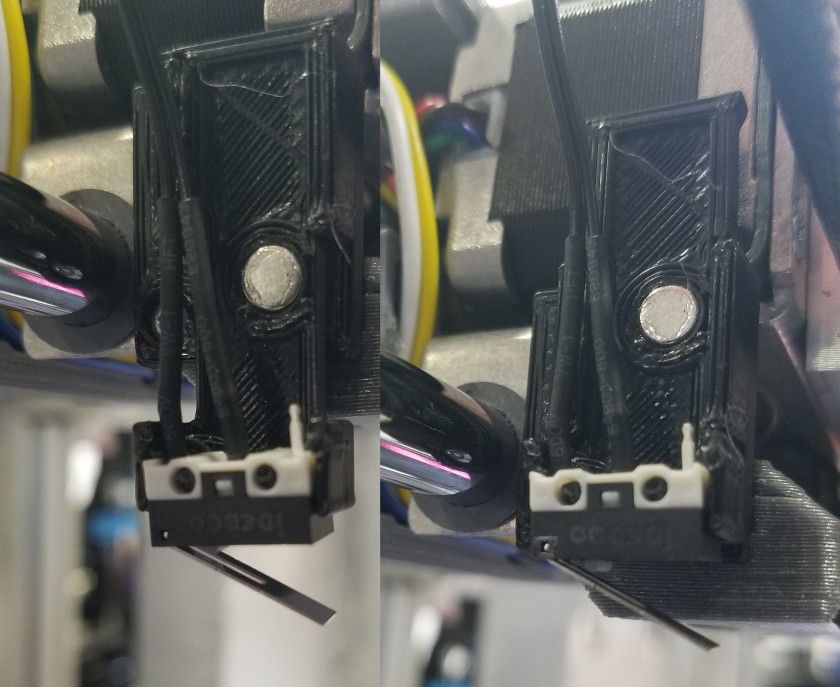
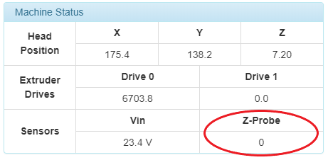

# The Bed & Probe

The print bed is a very crucial piece on the Promega. When printing on a 3D printer it is important to have an even and level bed relative to your nozzle. This means that your print bed should not have bumps and should be parallel to the plane that the coreXY moves along. This is extremely hard to maintain across a print bed that is almost 400mm x 400mm! When you heat up your heated bed the bed will warp and your print surface will not be level or even. It is important to have a level bed because a 3D printer has to be able to get it's filament to stick to the bed. If the bed is 0.2mm too high the extruder will end up printing in air, and if the bed is 0.2mm too low the nozzle could crash into the bed. So the tolerances are extremely tight! There are multiple things you can do in order to ensure that your bed is as level as possible. First of all you can mechanically level your bed by skipping bed teeth. But this will only get you an accuracy of ~1mm, and that is not enough. Duet Firmware has a bed leveling compensation process that is supported. This is highly recommended for printing large prints! A heated bed is very important to prevent warping of a print and ease first layer adhesion to the build plate. A hot bed can prevent print warping as it keeps the temperature of the first layer at a consistent temperature. A warping print can peel off the heated bed and ruin your print.

### Z-probe Offset

As you might have read previously, the extruder assembly contains two Z-probes. The IR probe, located on the right of the extruder assembly and the Z-probe limit switch on the right side of the extruder. Both of these Z-probes serve the same purpose, zero-ing the Z-axis and leveling the bed. This beginners guide will cover only how to calibrate and use the Z-probe limit switch. The IR probe is recommended for more advanced users as it tends to be more noisy and inconsistent under the wrong conditions. The Z-probe limit switch is easier to produce consistent and reliable results with.

**The Limit Switch**

Z-probes are extremely useful to zero the Z-axis. This is because the Z-probes typically have a reliable and constant offset from the nozzle. Once you find that offset, you run a G-code command in order to ensure that your print will be successful. The limit switch Z-probe is simply an end-stop attached to a deployable 3D printed mount. In the picture above you can see the limit switch in the deployed state on the left and the non-deployed state on the right. Deploy the limit switch by pressing down on the 3D printed tab and retract the probe by pulling the switch up. It is important for the limit switch to be deployable because the limit switch needs to make contact with the bed whenever you are probing, but it should be out of the way whenever you are printing. Whenever you send the probe command `G30` the bed will move up toward the nozzle until the Z-probe is triggered. When the Z-probe is triggered, the Z-value of the printer is set to the Z-offset of the Z-probe. You can set the Z-offset of the Z-probe with the `G31` command and its parameters.

**Always deploy the switch before probing**. This is extremely important, otherwise you **will** crash the nozzle into the print bed as the Z-probe will never be triggered.

**Setting the Limit Switch Offset**

1. Home the printer again, just to ensure you do not crash the printer throughout this process.
2. Print head to the center of the build plate by sending the command `G1 X200 Y200`
3. Heat up the bed to the preferred printing temperature. You can do this by sending the command `M140 Snnn` where `nnn` is your temperature in °C. You can always look up the recommended bed temperatures for specific materials online. For PLA, a bed temperature of 50°C will work well. For ABS-R, a bed temperature of 60°C is recommended. 
4. Wait until the heated bed has reached temperature before continuing.
5. Set the Z-probe offset to 0 by entering the command `G31 G31 P999 X-40 Y28.5 Z0`. This will make it easier to gauge the distance between the Z-probe and the nozzle in the following steps.
6. Run the command `G29 S2`. This clears any active bed leveling compensation. This is **very** important as it will conflict with your updated Z-probe offset and induce a 0.1 - 0.3mm error depending on the magnitude of your bed leveling compensation at that point.
7. Deploy your Z-probe
8. Check whether the Z-probe is functioning correctly. This is a great step to perform before using your Z-probe in order to prevent crashes. Press your Z-probe limit switch and observe the change in value from 0 to 1000 in the Duet Web Console _Machine Status_ table in the _Z-Probe_ box. If the value does not change the Z-probe is wired or configured wrong, do not continue to the next step!

   

9. Move the bed towards the nozzle by sending the command `G1 Z20`. When you send the command `G30` the bed will move slowly and precisely to the Z-probe, if you send `G30` while the bed is at `Z100` or greater you will have to wait for a long time for the Z-probe to trigger.
10. Run the command `G30`. This will move the bed toward the z-probe until the limit switch triggers.
11. Now your Z0 is set to your Z-probe limit switches trigger height. This is because the Z-probe limit switch offset is 0mm. Now that we have set our Z0 to the trigger height we can move the bed toward the nozzle in order to find the distance between the trigger height of the Z-probe and the nozzle!
12. Retract the Z-probe.
13. Jog the bed up slowly toward the nozzle using the negative Z buttons in _Machine Control_ on the Duet Web Console. Read the next step!

    

14. As you are moving the bed up towards the nozzle you will encounter an axis limit. These axes limits are set for the X, Y and Z axes and will stop you from moving past a certain coordinate. This will make it harder to crash the printer. However, in this case we know what we are doing so we can disable the axes limits. Send the command `M564 S0` to disable the axis limits. To learn more about this command visit the [RepRap G-code wiki](https://reprap.org/wiki/G-code#M564:_Limit_axes).
15. **Be careful when moving the bed close to the nozzle. Use the 1mm and 0.1mm buttons.** Determining when the bed is touching the nozzle can be difficult. You might have to heat up the nozzle as you learned before in order to ensure that none of the filament from the hot-end gets in the way. Using a piece of paper to determine when the nozzle is touching the bed is also helpful. Grab a sticky-note or small piece of paper and place it under the nozzle. Then carefully jog the bed into the nozzle, move the paper back and forth. When you feel the nozzle grab the paper your nozzle is touching the bed!. 
16. Record the Z-value that the printer is currently displaying in _Machine Status_. The absolute \(non-negative\) of this value is your Z-probe offset. It might be a good idea to write down this value.
17. Enter the command `G31 P999 X-40 Y28.5 Znnn` where `nnn` is your Z-probe offset.
18. Move the bed away from the nozzle `G1 Z20`.
19. Deploy your Z-probe!
20. Send the command `G30`.
21. Move the bed back up to the nozzle as described in the steps above. Your Z value should be 0 when the bed is touching the nozzle. If it is not you might need to tune the Z-probe offset or repeat the process.
22. In order for these changes to take effect permenantly, you will have to open up your _config.g_ file and update the Z-offset of this command there. Follow the section below.

**Your Z-probe offset will not change unless you make changes that can affect the distance between your Z-probe trigger height and your nozzle.**

