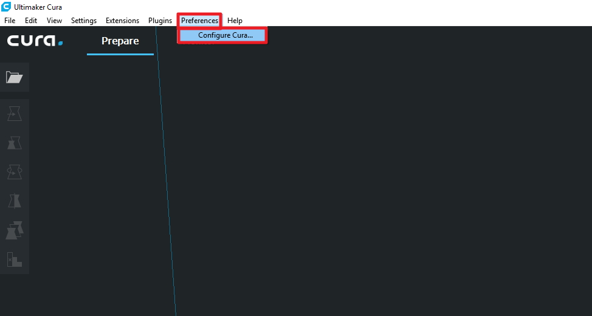
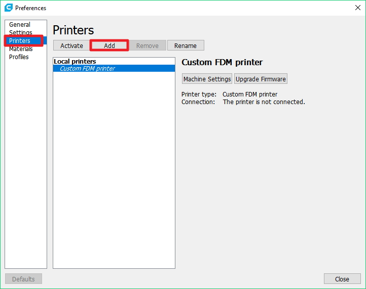
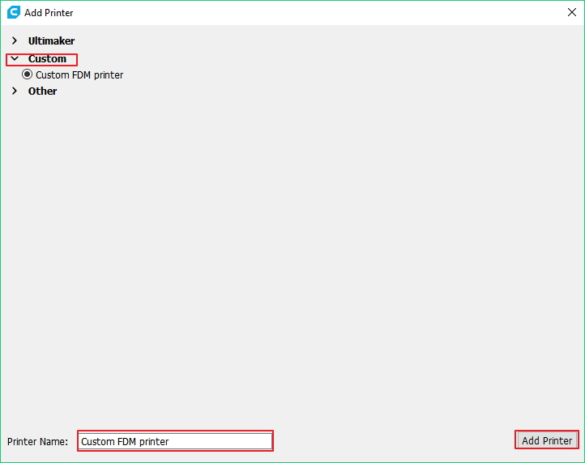

# What is Slicing?

Work in Progress!

Whenever you want to print a model you will have to convert the model to a _.gcode_ file type. This file type is a huge list of G-code commands that the Duet Board will process one by one in order to achieve a complete print. The G-code file is generated by software called a slicer. A slicer takes a model applies certain print and printer settings and generates the _.gcode_ file. The model also has to be of a specific file type called a _.STL._ This file type can be generated from a CAD model that you designed or downloaded from the internet from websites such as [Thingiverse](https://www.thingiverse.com/), [Pinshape,](https://pinshape.com/) [MyMiniFactory ](https://www.myminifactory.com/)and many others! 

## Finding an _.STL_ File

It is possible to create your own _.STL_ file by downloading a CAD \(Computer Assisted Design\) software such as SolidWorks or [TinkerCAD](https://www.tinkercad.com/). However, in order to take things one step at a time, we will go online and download a working model from the internet. This is because multiple constraints of the 3D printer have to be taken into account when designing a model for printing with a 3D printer.

Go to one of the websites listed above and download a _.STL_ model of something you would want to print. For this guide I am going to use this model: [Customizable Yin-Yang Planter / Container](https://www.thingiverse.com/thing:2531208) by [Lucina M](https://www.thingiverse.com/Lucina/about). Follow the red markings below. Click Thing Files and then click the models you want to download the ._STL_ files of. These files will then end up in your downloads folder.

Next, we will move on to installing a slicer to slice the models we just downloaded.

## Installing Cura

For this guide we will use Cura to slice our model. [Download it here!](https://ultimaker.com/en/products/ultimaker-cura-software) 

Continue with the installation process until you are able to launch Cura.

### Configuring Cura

Open Cura's Setting by pressing _Preferences &gt; Configure Cura._ 

Once you have opened Cura's settings we will go to add a printer. This is because we need to tell Cura the specifics of our printer, such as the maximum build volume of the printer. Press _Printers_ and then _Add_ in order to add a new printer. This will open a new window.

 Next, press _Custom._ This indicates we are adding a custom printer to Cura's loadout. You can define the _Printer Name_ however you want. Then press _Add Printer,_ this should open another setting window_._ 

This window allows you to configure the printer settings of the Promega. This informs Cura of the Promega's build space, the firmware flavor and specifies starting and ending G-code. The build volume of the printer represents the maximum value that the printer can travel in each direction. The firmware flavor is the type of firmware that the board is running. The Duet Maestro board runs on RepRap firmware. Your firmware flavor indicates what type of commands the board can understand. The starting and ending G-code is a series of commands that are run at the start and at the end of every print. This is important as it allows you to retract your filament after the print and turn all the heaters off. Configure the settings in this window exactly as shown in the image below.

 

`; Starting G-code:  
G1 Z15.0 F6000 ;Move the platform down 15mm  
;Prime the extruder  
G92 E0  
G1 F200 E3  
G92 E0`

`; Ending G-code  
M104 S0   
M140 S0   
M106 S0   
G28 X Y   
G91   
G1 Z10 S1   
G90   
;Retract the filament   
G92 E3   
G1 E-3 F300`

**Don't click** _**Close**_ **just yet!** Move on to the _Extruder 1_ tab and fill in the following information. Fill in the nozzle diameter and the material diameter. Your nozzle diameter may vary in the future as you mount different types of nozzles on the Promega. Then you can click _Close._

