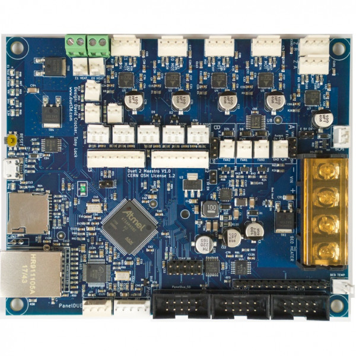
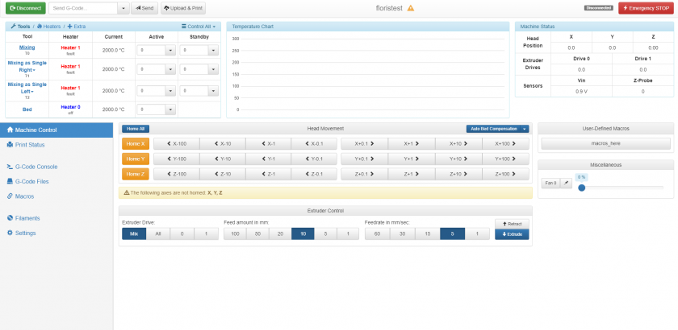
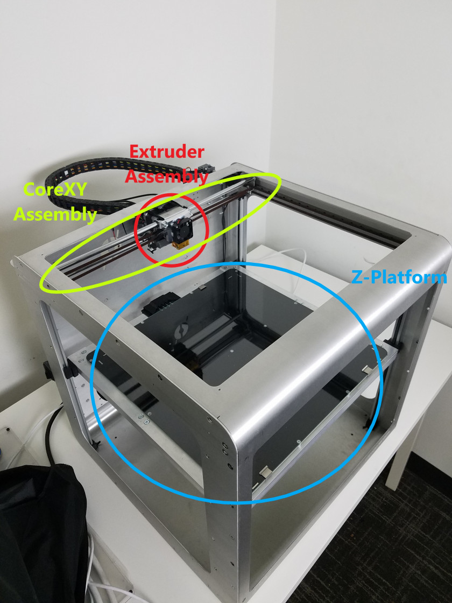
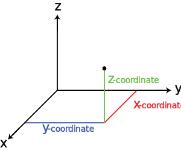
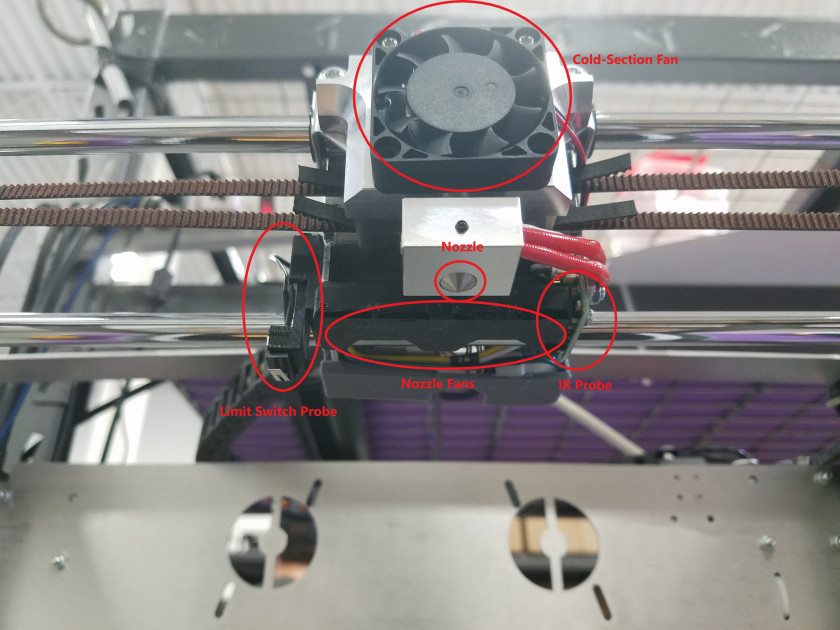
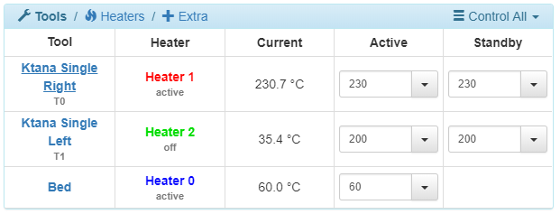
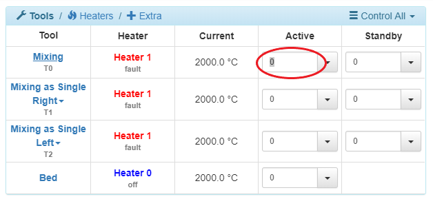
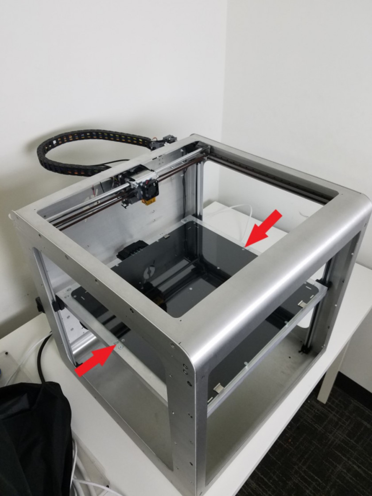
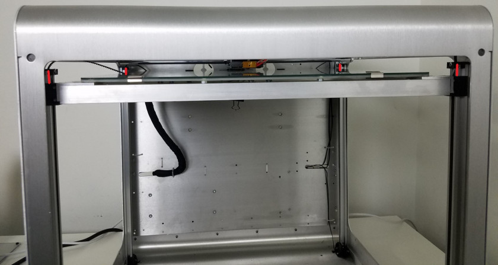

# Beginners Guide

WORK IN PROGRESS!

This guide provides a supplement of information to the [Getting Started](https://m3d.gitbook.io/promega-docs/getting-started) Chapter. This guide serves as an introduction to 3D printing and the Promega for new 3D printer users. Follow this guide from start to finish in order to gain a better understanding of the fundamental concepts of a 3D printer and the Promega! If you are more familiar with 3D printing or similar concepts feel free to continue on to other guides!

## Network Setup

1. Complete the [Network Setup](https://m3d.gitbook.io/promega-docs/getting-started/network-setup) guide. This will allow you to connect to the Duet Web Console on the Duet Maestro, the control board of the Promega \(pictured below\). The Duet Web Console is a web interface that allows you to control the Promega in a much easier manner. The second image below shows the homepage of the Duet Web Console.

   

   

## Printer Assemblies

This guide will cover a significant amount of technical knowledge and terms. The different assemblies of the Promega will be mentioned frequently in the sections below.

List of Promega Assemblies:

* **Extruder Assembly**: This heats up and prints the filament. It is also referred to as the extruder carriage.
* **CoreXY Assembly**: A belt system that allows the extruder carriage to travel on a plane.
* **Z-platform**: A heated bed that is actuated up and down with belts.

  

## Printer Coordinates

In your math classes you have probably heard the term: _Cartesian Coordinates_. This intimidating term is not as bad as it sounds. It refers to the 3D coordinate system that is used almost every where, including the Promega. It features three different axes \(X, Y and Z\), all perpendicular to each other, as seen in the image below. The origin of the cartesian system is located at the intersection of the three different coordinate axes. At this point, the X, Y and Z position are all zero.



In the case of the Promega, the cartesian coordinate frame is used to track the location of the nozzle. The nozzle can be considered a point that can be moved along the X, Y and Z axes in the printer. The nozzle is moved in the X and Y directions with a coreXY belt system and in the Z-direction with the z-platform. The orientation of the cartesian coordinate frame is not the same as in the image below. Look below to see the cartesian coordinate frame in the Promega.


**The Origin**

The origin of the Promega is located at the front-top-left corner of the printer, where the three red lines intersect. If the printer moves to X0, Y0 and Z0, or \(0,0,0\) it will end up in this corner. The position of the nozzle of the printer is measured from this point. As mentioned before, the printer moves in the X and Y direction with the a coreXY belt system, which we will go over later. The Z-axis works differently, instead of moving the nozzle away from the bed, the Promega moves the bed away from the nozzle. The nozzle is always located on a single plane which it can be moved across by the coreXY system. The Z-axis distance value increases as you move the bed **down**, away from the nozzle, and the distance decreases as you move the bed **up**, toward the nozzle. This might be counter-intuitive at first, as a normal oriented cartesian coordinate frame will have the Z-axis pointing up, but you will get used to it quickly.

**Coordinate Units**

The Promega 3D printer uses millimeters as units. All the commands given to the printer will be in millimeters. For example, if you told the printer to go to \(200, 380, 150\) or 200 mm in the X direction, 380 mm in the Y direction and 150 mm in the Z direction it might look something like in the image below. The distances are measured from the origin of the Promega, depicted by the circle in the image below.


**Machine Status**

The Duet control board will keep track of its current position relative to its origin. Again, the origin is where the X, Y and Z position of the 3D printer are 0. The position of the printer can be found in the Duet Web Console on the top-right in a table labeled _Machine Status_. This can be seen in the image below where the printer displays a position of 300 mm in the X-direction and 300 mm in the Y-direction and 159.1 mm in the Z-direction. Remember that this is all relative to the origin of the printer.


**Homing**

The origin of the printer can change as well, as shown in the images above, it is usually in the top-front-right corner, but only after you home the printer. Homing the printer, which will be covered later, will send the printer to the limit switches and update the position of the printer. Whenever you start the printer, the printer will reset its previous position and label its current position as \(0,0,0\). This means that the position where you power on your printer is \(0,0,0\) is considered the origin, until you home the printer. Therefore, **it is very important to home the printer once you switch on the printer.** Keep track of the _Machine Status_ table on the Duet Web Console to see where the printer thinks it currently is located.

**Moving the Motors**

Before you power on your motors you can manually move the extruder head around the printer. Follow the steps below in order to start moving the printer.

1. Move the extruder head to the center of the printer by hand. This should not take a lot of effort to do as long as the motors are not powered. Once you move the motors, the motors will be powered and resist any force acted on them.
2. Go to the _Machine Control_ tab of the Duet Web Console.


1. Press _Home All_, this will home all the axes of the printer and ensure that the origin of the printer is located at the front-top-left corner of the 3D printer. After the homing process is complete, you can see that the position of the 3D printer is updated in the _Machine Status_ tab on the Duet Web Console.
2. Press the X-10 button in the _Head Movement_ window. This will move the extruder carriage of the printer 10mm in the negative X direction, this should be towards the left if you are facing the front of the printer. Now press the Y-10 button, this will move the printer -10 mm in the Y-direction. If you are facing the front of the printer, this should send the extruder carriage towards you. You can also press the Z buttons, but remember that the bed is all the way down and resting on the limit switch after the homing process. You will have to move the bed in the negative Z direction in order to move it up. Press the Z-10 button in order to move the bed up 10 mm.
3. You can keep pressing the buttons to move the extruder carriage to become more familiar with the directions and coordinate system of the Promega.

**Absolute vs. Relative**

A 3D printer movement allows for two different modes, absolute and relative. These two terms are also used frequently in machining and other engineering processes. Absolute describes a position or command with respect to the origin or zero position. Relative describes the position of a 3D printer relative to the previous point. For example, if you tell the printer to move \(20,20,20\). Absolute mode will send the printer to the point where X = 20mm, Y = 20mm and Z = 20mm. While relative will send the printer 20 mm in the X-direction, Y-direction and Z-direction relative to its previous position. This means your printer will go to two completely different places depending on if you are in relative or absolute mode.

## G-Code Commands

Now that you are familiar with the coordinate system of the Promega, its orientation and direction, we can get started with learning and sending G-code commands. G-code commands are sent one line at a time, with one command per line. When you send a print file to your printer in order to print something, you are sending the printer a long list of G-code commands. It will look something like this \(but way longer!\):

```text
G1 X173.448 Y182.05 E0.03872
G1 X173.922 Y181.843 E0.03871
G1 X174.422 Y181.712 E0.03868
G1 X174.883 Y181.662 E0.0347
G1 X178.301 Y181.524 E0.256
G1 X183.787 Y181.051 E0.41207
G1 X189.186 Y180.278 E0.40816
G1 X194.553 Y179.196 E0.40972
G1 X197.18 Y178.55 E0.20245
G1 X202.457 Y177.012 E0.41134
G1 X208.239 Y174.993 E0.45832
G1 X208.864 Y174.84 E0.04815
G1 X209.841 Y174.699 E0.07387
G1 X210.32 Y174.665 E0.03594
G1 X240.74 Y174.665 E2.27649
G1 X241.414 Y174.733 E0.0507
G1 X242.865 Y175.031 E0.11085
G1 X243.362 Y175.174 E0.0387
G1 X243.641 Y175.293 E0.0227
G1 X244.676 Y175.79 E0.08592
G1 X245.287 Y176.169 E0.05381
G1 X245.992 Y176.719 E0.06691
G1 X246.435 Y177.134 E0.04543
G1 X247.028 Y177.801 E0.06679
G1 X247.379 Y178.274 E0.04408
G1 X247.842 Y179.028 E0.06621
G1 X248.113 Y179.576 E0.04575
G1 X248.46 Y180.476 E0.07218
G1 X248.633 Y181.098 E0.04831
G1 X248.792 Y181.998 E0.06839
G1 X248.843 Y182.581 E0.0438
```

**Basic Commands**

The command, `G1`, you are see above is called the move command. This is arguably the most important G-code as it allows you to move the printer. Each G-code command consists of a letter followed by a number. `G31`, `M564` and `T0` are all valid G-code commands as well. The Duet Maestro control board runs [RepRap Firmware](https://reprap.org/wiki/RepRap_Firmware). This firmware determines what commands are valid, and which commands are not. You can find all the valid commands that you can send in a long list on the [RepRap Wiki G-codes Page](https://reprap.org/wiki/G-code). After the initial letter-number combination of the G-code command a parameter can follow. This is also visible with the G-code commands listed above, the command `G1 X248.843 Y182.581 E0.0438` has `X248.843 Y182.581 E0.0438` as parameters. Many different G-code commands have optional parameters that can be entered after the initial command.

**Absolute vs. Relative in Commands**

With the `G1` command you can move the printer. However, where the `G1` command moves your printer depends on whether you are in absolute or relative mode. Absolute mode is enabled whenever you send the command `G90`, relative mode is enabled when you send the command `G91`. Whenever you are printing absolute mode is typically enabled. If you restart your printer, absolute mode will also be enabled. If you send the command `G1 X150 Y120 Z100` in absolute mode \(`G90`\), the printer will move to the position X = 150mm, Y = 120mm and Z = 100mm, **relative to the origin**. If you send the same command in relative mode \(`G91`\), it will send the printer 150 mm in the positive X-direction, 120 mm in the positive Y-direction and 100 mm in the Z-direction relative to where the printer currently is positioned. The same command can send the printer to two completely different places depending on what mode you are in. As you saw in one of the commands above, the move command, `G1`, can also have an `E` parameter, this allows for a movement of the extruder motor.

**Feedrate**

Aside from the `X`, `Y`, `Z` and `E` parameters which allow the printer to move each of the motors, there is one other important parameter `F`. `F` is the feedrate of the motor, or is simple terms, the speed that the motor will travel at. The units of the `X`, `Y`, `Z` and `E` parameters is mm. However for `F` or feedrate the units are `mm/min`. A normal travel feedrate \(speed\) would be 3000mm/min, but for printing the feedrates are typically much lower.

**The Movement Buttons**

In one of the steps above you used the buttons in _Machine Control_ to move the printer. What is really happening here is that when you press a button a list of G-code commands are sent to the printer. For example, if you press the X+10 button to move the printer 10mm in the positive X-direction this is what is actually sent:

```text
M120
G91
G1 X10 F6000
M121
```

You might be familiar with two of the G-code commands here `G91` and `G1`. `G91` enables relative mode, so the next move command that is sent will be with respect to the printers current position and not the origin. After the `G91` command, the move command `G1` is sent. This sends the printer 10mm in the positive X-direction at a feedrate of 6000mm/min. The `M120` and `M121` commands are stack push and pop. If you are not familiar with these two programming terms, then don't worry, they are not important to know for a beginning user. All you have to know is that it will disable relative mode `G91` and return to absolute mode `G90`. This is because you want the printer to be back in absolute mode after pressing the move buttons.

**Sending G-code Commands**

Now that you are more familiar with G-code commands you can try to complete the steps below in order to see how the printer responds to you sending G-code commands directly to the printer itself.

1. Find the _G-code Console_ tab in the Duet Web Console. 


1. This tab allows you to send commands to the printer using the textfield as seen above. Once you enter a command in the text field you can press _Enter_ or press the dark-blue send button. The printer will then process the command and execute it. If the command executed successfully you will see a print out of the command you send in the _Printer Printout_ terminal with a green background. If the firmware encountered an error while trying to process the command, it will printout the command with a red background and more information about the error. 3. This step assumes you have the printer homed from the previous steps. If you have not yet homed your printer, click the _Home All_ button in the _Machine Control_ tab. Try sending the command `G1 X200 Y200`. This will move the printer to 200 mm X and 200 mm Y. Send the command `G1 Z150`. This will move the bed to about 150 mm from the nozzle. 4. You can keep sending commands to move the printer around the buildspace. The table below represents the limits of the printer, the firmware should prevent you from going past these limits. Still, try to keep your move commands within the buildspace of the printer. You can also try to change the feedrate of the printer to see how the speed of the printer changes as the printer moves around.

|  | Axes Limits |  |
| --- | --- | --- |
|  | Max \(mm\) | Min \(mm\) |
| X - Axis | 388 | 0 |
| Y - Axis | 388 | 0 |
| Z - Axis | 377 | 0 |

**Other G-code Commands**

Of course there are many more RepRap supported G-code commands \(as you might have seen on the [RepRap Wiki](https://reprap.org/wiki/G-code)\). You will come across some of them as you follow this guide. Whenever you have questions about what a command does, you can look up the command on the wiki.

Throughout the different guides you will find G-code in `this format`. That typically means you can execute the G-code command. Comments are denoted by any text following a semi-colon ";". A new line will end the comment.

`G1 X100 ; This is a comment!`

## The Extruder

Next, we will move on to one of the most important assemblies on the Promega, the extruder! This complicated assembly can reach temperatures above 300°C in order to melt plastic and print it. The extruder assembly contains a fan directly on the front, this is called the _Cold-Section Fan_. It is meant to keep the extruder block, directly behind it, cold. If the extruder block gets too hot, the filament could start melting before the filament ever reaches the nozzle. On the underside of the extruder assembly, there are two smaller fans called _Nozzle Fans_. These are meant to call any filament that is pushed out of the nozzle so that it immediately becomes rigid. On the right of the nozzle fans is a small electronics board called the _IR Probe_. This probe uses Infra-Red rays in order to detect the bed. On the left of the extruder is a small deploy-able limit switch, this is also a Z-probe. Z-probes are used in order to measure the exact distance from the nozzle to the bed. They are also used in order to level the bed of the printer as printing requires a very flat and level surface. You can view the image below to see a diagram of the different extruder components.



### Tools

Tools are a relatively new concept in 3D printing. They allow you to create different extruder configuration ahead of time that you can quickly switch between while printing. The Duet Maestro board uses tools in order to allow printing with multiple extruders, or mixing extruders. The Promega actively makes use of this in order to print with different tool mixing ratios, or do dual nozzle prints with the K'tana. You can find your currently configured tools in the Duet Web Console in a table labeled: _Tools/Heaters/Extra_ on the top-left.



In the image above there are two different tools. In RepRap firmware, tools are defined as `Tnnn`, where `nnn` represents a tool number. In the image above there are tools T0 and T1. Each tool has it's own extruder motor attached to it, or multiple if you are mixing. A tool also has one heater attached to it. All these tools are defined and configured when the printer powers up with G-code commands, we will go over how exactly that works later. Below are the default tools for the Compound and K'Tana setups. In order to select a tool you can either click on the tool name in the Duet Web Console or you can send the command `Tnnn` where `nnn` represents the tool number. If you wanted to switch to tool 0, you would send the command `T0`. The Duet Web Console always shows you which tool is selected: it will underline the tool name. In the image above T0 is selected.

Compound Tools:

* `T0`: Mixing tool
  * Extruder 0 \(Left\) & Extruder 1 \(Right\)
  * Heater 2
  * Allows for extruding two filaments and combining them at a 1:1 ratio
* `T1`: Single Left
  * Extruder 0 \(Left\)
  * Heater 2
  * Extrudes with only the right extruder
* `T2`: Single Right
  * Extruder 1 \(Right\)
  * Heater 2
  * Extrudes with only the left extruder

K'Tana Tools:

* `T0`: K'tana Single Right
  * Extruder 1 \(Right\)
  * Heater 1
* `T1`: K'tana Single Left
  * Extruder 0 \(Left\)
  * Heater 2

In the future, if you find that none of your extruders are working, or an extruder you didn't expect to be running is running, chances are you have the wrong tool selected. Use the `Tnnn` command in order to select a tool with number `nnn`.

### Filament Properties

There are many different filament types used in the 3D printing industry, a [Google search](https://www.google.com/search?q=3d+printing+materials&oq=3d+printing+materials&aqs=chrome..69i57.3072j0j1&sourceid=chrome&ie=UTF-8) will prove that. They vary in material, diameter and many other properties. The Promega allows you to print with 1.75mm diameter filament. The Promega can also print many different materials, but if you are a beginner we recommend ABS-R or PLA. These two materials tend to be easiest to print with. PLA prints well at around 200°C and ABS-R at 230°C. Printing temperature varies greatly depending on what material you are printing with. Please do appropriate research before attempting to extrude a new filament. Follow the section below in order to get started with extruding.

### Loading Filament

To load filament into the extruder you will need to find two small holes on the top of the extruder assembly. 1.75mm diameter filament can be loaded into this opening. It will then be grabbed by the extruder motor and pushed down into the hot-end. The hot-end term refers to the pieces of the extruder which will heat up in order to melt the plastic. In the Promega's case that is the nozzle and the aluminum block surrounding it. Once the filament is melted in the hot-end it will come out of the nozzle. The compound nozzle will have two holes to allow entry to two different filaments. It then melts both filaments and combines them to produce one stream of filament coming out. The K'Tana has two different nozzles and therefore each filament will get extruded out of separate nozzles. To load filament follow the steps below.


1. To load filament into the extruder you will first have to heat up the nozzle. It also helps to have the extruder located in the center of the printer. So move the extruder to the center of the printer by entering the command `G1 X200 Y200`.
2. There are multiple ways to heat up the nozzle to your desired temperature. One is with a G-code command and the other is with the Duet Web Console. Heating up tools with the Duet Web Console is the easiest. In the table _Tools/Heaters/Extra_ on the Duet Web Console, enter the desired temperature in the circled box below \(your _Current_ reading should not have a value of 2000°C, 2000°C is an error value\). Once you have entered the temperature press Enter. You should now see a steady rise in temperature in the _Current_ box and on the graph to the right. The temperature you set should depend on the filament you are planning to extrude.

   

3. Once the extruder has reached it's set temperature you are ready to load your filament. Take the filament and insert it into the opening circled in red in the image above. If you are attempting to extrude with a Compound nozzle, you will have to load filament into both openings in the extruder. For the K'Tana you will only have to load filament on one side. Now, on the Duet Web Console go to the _Machine Control_ tab in order to move the extruder motors. In this tab there is a box called _Extruder Control_. Here you can select the extruder you want to control and how much filament you want to extrude and at what speed. If you have the Compound nozzle, set the _Extruder Drive_ settings to _Mix_ in order to get both extruder motors to push filament. If you have the K'Tana, select Drive 0 or 1 depending on which side you loaded filament into. The _Feedrate amount_ should be set to 10mm and the _Feedrate_ to 5mm/sec. You can then press _Extrude_ this should move the filament into the extruder. It could be possible that you have to push the filament properly into the opening until the extruder grabs it.

   

4. Once the filament is inside the extruder keep pressing _Extrude_ until filament comes out of the nozzle. You can increase the _Feed amount_ to 50mm or more to decrease the times you have to press _Extrude_.
5. Congratulations, you have just created your first print! It probably looks like a long stream of filament, but that counts, right? You can keep pressing the _Extrude_ button for as long as you like, or you can move on to the next section.

### Extruding with G-code Commands

The steps that you accomplished above in order to extrude filament can also be done with G-code commands. Follow the steps below in order to learn more G-code commands.

1. Select your appropriate tool with `Tnnn`. For example, tool 0 with `T0`.
2. Turn off the heat to your tool by sending the command `G10 Pnnn S0`. `G10` allows you to set a tool temperature. The `P` parameter and `nnn` represents your tool number that you want to change the temperature of. `Snnn` is the temperature of the tool. So by setting the temperature to 0 the tool is turned off.
3. If you wanted to turn the temperature of a tool back on you would have to enter the command `G10 P0 Snnn` where `nnn` is your new tool temperature. The `G10` `S` parameter only sets the **active** temperature of a tool. This means the tool will only go to that temperature when it is selected or active.
4. If you wanted to extrude 100mm of filament at a feedrate of 20 mm/sec you could enter the commands below. Remember that you should zero your extruder first before telling your extruder to move. This is because your extruder could have a very high position in mm, for example 10291mm. If you then tell the extruder to move to the absolute position of 100mm. The extruder will have to travel 10191mm backwards, and that will take a long time! You can also turn on relative extruder moves with `M83`, and then you would not have to zero the extruder as it just adds 100mm to the position the extruder is already at.

   ```text
   G92 E0
   G1 E100 F120 ; Remember that Feedrate is in terms of mm/min!
   G92 E0
   ```

   ```text
   M83 
   G1 E100 F120
   M82
   ```

5. To retract, pull filament back into the extruder, send a negative extruder position. Like `G1 E-100 F3000`.

### Alternative Commands to Heat

Throughout your printing career with the Promega you will notice other commands to heat up your nozzle. `M104` and `M105` can also be used to heat up your tools.

`M104 Snnn`: Heat up your active tool to `nnn`°C.

`M109 Snnn`: Heat up your active tool to `nnn`°C and wait until temperature is achieved.

`M140 Snnn`: Heat up your bed to `nnn`°C.

`M190 Snnn`: Heat up your bed to `nnn`°C and wait until temperature is achieved.

## The Bed

The print bed is a very crucial piece on the Promega. When printing on a 3D printer it is important to have an even and level bed relative to your nozzle. This means that your print bed should not have bumps and should be parallel to the plane that the coreXY moves along. This is extremely hard to maintain across a print bed that is almost 400mm x 400mm! When you heat up your heated bed the bed will warp and your print surface will not be level or even. It is important to have a level bed because a 3D printer has to be able to get it's filament to stick to the bed. If the bed is 0.2mm too high the extruder will end up printing in air, and if the bed is 0.2mm too low the nozzle could crash into the bed. So the tolerances are extremely tight! There are multiple things you can do in order to ensure that your bed is as level as possible. First of all you can mechanically level your bed by skipping bed teeth. But this will only get you an accuracy of ~1mm, and that is not enough. Duet Firmware has a bed leveling compensation process that is supported. This is highly recommended for printing large prints! A heated bed is very important to prevent warping of a print and ease first layer adhesion to the build plate. A hot bed can prevent print warping as it keeps the temperature of the first layer at a consistent temperature. A warping print can peel off the heated bed and ruin your print.

### Z-probe Offset

As you might have read previously, the extruder assembly contains two Z-probes. The IR probe, located on the right of the extruder assembly and the Z-probe limit switch on the right side of the extruder. Both of these Z-probes serve the same purpose, zero-ing the Z-axis and leveling the bed. This beginners guide will cover only how to calibrate and use the Z-probe limit switch. The IR probe is recommended for more advanced users as it tends to be more noisy and inconsistent under the wrong conditions. The Z-probe limit switch is easier to produce consistent and reliable results with.

**The Limit Switch**


Z-probes are extremely useful to zero the Z-axis. This is because the Z-probes typically have a reliable and constant offset from the nozzle. Once you find that offset, you run a G-code command in order to ensure that your print will be successful. The limit switch Z-probe is simply an end-stop attached to a deployable 3D printed mount. In the picture above you can see the limit switch in the deployed state on the left and the non-deployed state on the right. Deploy the limit switch by pressing down on the 3D printed tab and retract the probe by pulling the switch up. It is important for the limit switch to be deployable because the limit switch needs to make contact with the bed whenever you are probing, but it should be out of the way whenever you are printing. Whenever you send the probe command `G30` the bed will move up toward the nozzle until the Z-probe is triggered. When the Z-probe is triggered, the Z-value of the printer is set to the Z-offset of the Z-probe. You can set the Z-offset of the Z-probe with the `G31` command and its parameters.

**Always deploy the switch before probing**. This is extremely important, otherwise you **will** crash the nozzle into the print bed as the Z-probe will never be triggered.

**Setting the Limit Switch Offset**

1. Home the printer again, just to ensure you do not crash the printer throughout this process.
2. Print head to the center of the build plate by sending the command `G1 X200 Y200`
3. Heat up the bed to the preferred printing temperature. You can do this by sending the command `M140 Snnn` where `nnn` is your temperature in °C. You can always look up the recommended bed temperatures for specific materials online. For PLA, a bed temperature of 50°C will work well. For ABS-R, a bed temperature of 60°C is recommended. 
4. Wait until the heated bed has reached temperature before continuing.
5. Set the Z-probe offset to 0 by entering the command `G31 G31 P999 X-40 Y28.5 Z0`. This will make it easier to gauge the distance between the Z-probe and the nozzle in the following steps.
6. Run the command `G29 S2`. This clears any active bed leveling compensation. This is **very** important as it will conflict with your updated Z-probe offset and induce a 0.1 - 0.3mm error depending on the magnitude of your bed leveling compensation at that point.
7. Deploy your Z-probe
8. Check whether the Z-probe is functioning correctly. This is a great step to perform before using your Z-probe in order to prevent crashes. Press your Z-probe limit switch and observe the change in value from 0 to 1000 in the Duet Web Console _Machine Status_ table in the _Z-Probe_ box. If the value does not change the Z-probe is wired or configured wrong, do not continue to the next step!

   

9. Move the bed towards the nozzle by sending the command `G1 Z20`. When you send the command `G30` the bed will move slowly and precisely to the Z-probe, if you send `G30` while the bed is at `Z100` or greater you will have to wait for a long time for the Z-probe to trigger.
10. Run the command `G30`. This will move the bed toward the z-probe until the limit switch triggers.
11. Now your Z0 is set to your Z-probe limit switches trigger height. This is because the Z-probe limit switch offset is 0mm. Now that we have set our Z0 to the trigger height we can move the bed toward the nozzle in order to find the distance between the trigger height of the Z-probe and the nozzle!
12. Retract the Z-probe.
13. Jog the bed up slowly toward the nozzle using the negative Z buttons in _Machine Control_ on the Duet Web Console. Read the next step!

    

14. As you are moving the bed up towards the nozzle you will encounter an axis limit. These axes limits are set for the X, Y and Z axes and will stop you from moving past a certain coordinate. This will make it harder to crash the printer. However, in this case we know what we are doing so we can disable the axes limits. Send the command `M564 S0` to disable the axis limits. To learn more about this command visit the [RepRap G-code wiki](https://reprap.org/wiki/G-code#M564:_Limit_axes).
15. **Be careful when moving the bed close to the nozzle. Use the 1mm and 0.1mm buttons.** Determining when the bed is touching the nozzle can be difficult. You might have to heat up the nozzle as you learned before in order to ensure that none of the filament from the hot-end gets in the way. Using a piece of paper to determine when the nozzle is touching the bed is also helpful. Grab a sticky-note or small piece of paper and place it under the nozzle. Then carefully jog the bed into the nozzle, move the paper back and forth. When you feel the nozzle grab the paper your nozzle is touching the bed!. 
16. Record the Z-value that the printer is currently displaying in _Machine Status_. The absolute \(non-negative\) of this value is your Z-probe offset. It might be a good idea to write down this value.
17. Enter the command `G31 P999 X-40 Y28.5 Znnn` where `nnn` is your Z-probe offset.
18. Move the bed away from the nozzle `G1 Z20`.
19. Deploy your Z-probe!
20. Send the command `G30`.
21. Move the bed back up to the nozzle as described in the steps above. Your Z value should be 0 when the bed is touching the nozzle. If it is not you might need to tune the Z-probe offset or repeat the process.
22. In order for these changes to take effect permenantly, you will have to open up your _config.g_ file and update the Z-offset of this command there. Follow the section below.

**Your Z-probe offset will not change unless you make changes that can affect the distance between your Z-probe trigger height and your nozzle.**

**Setting the Limit Switch Offset in the Config.g**

### Mechanically Leveling the Bed

Now, we will make sure that the bed is visibly level. Then, we will heat up the bed and perform auto-bed leveling compensation.

1. If your motors are powered, you will not be able to move your bed by hand without skipping the motors. Whenever you activate or power your stepper motors, their position will be held with an idle current. This current will create a permanent stall torque on the motor. In order to disable the idle current on motors you can send the command `M84`. **If your bed is high up, disabling the Z-motor will make the bed drop down.**
2. Lift your bed up from the two points shown in the image below. Lift your bed up to the nozzle.

   

3. When the bed is touching the nozzle, determine the offset of the Z-sliders to the top belt clamps, as shown in the image below, to determine whether the bed is level. This will give you a good enough estimate to level the bed, bed leveling compensation with `G29` can take care of the rest. The bed can be leveled more accurately by using a caliper to measure the distance between the bed and the top of the Z-slider rails and comparing the corners.

   

4. Once you have determined which corner needs to be skipped, lift up the bed about half-way and grab that corner of the bed. Then, gently lift up from that corner until you hear a click and feel the corner give, you have just skipped a belt tooth. Keep repeating this process until all corners of the bed are level. Keep lifting the bed up to the nozzle to check if the bed is level.

