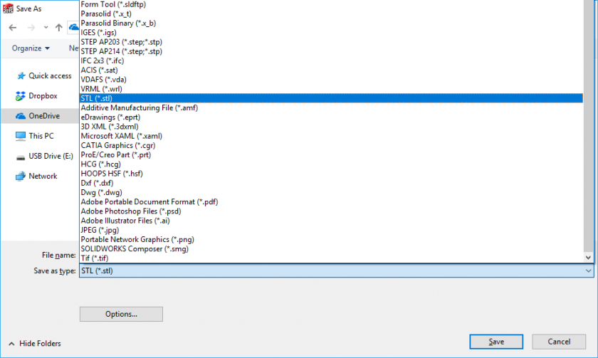
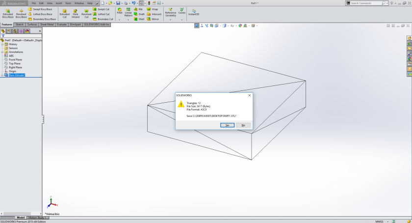
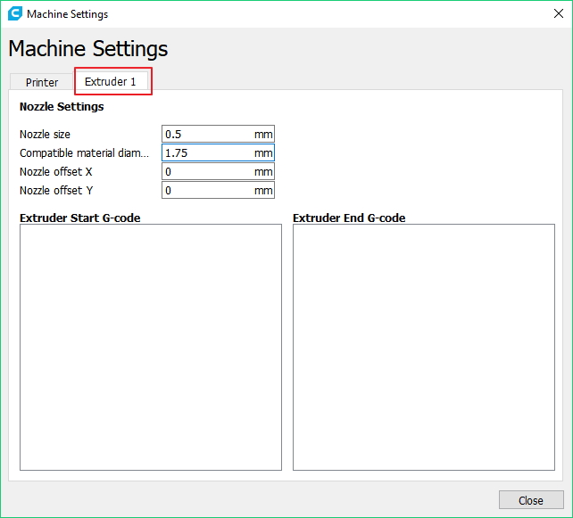
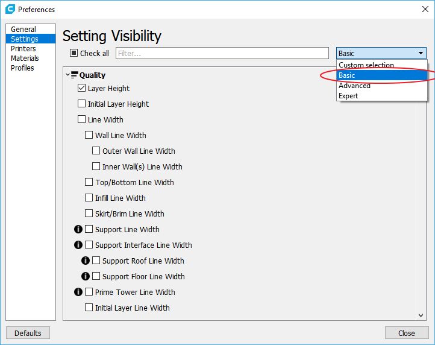
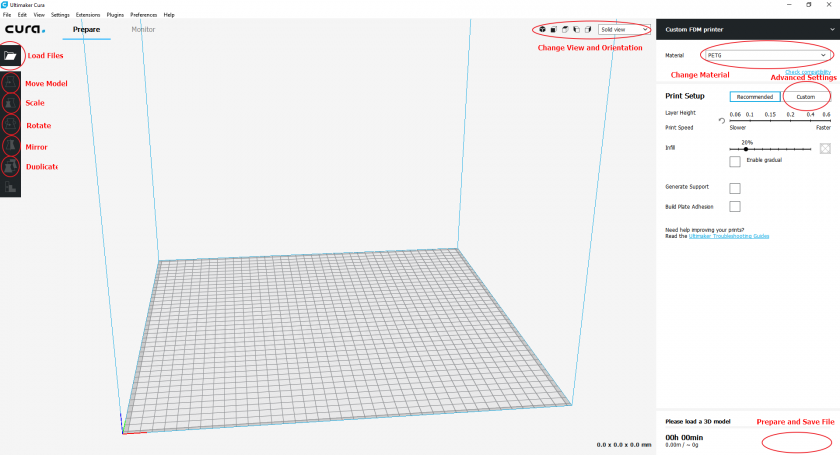

# Preparing a Print

Before uploading a print to the Duet board and printing it with the Promega, you will need to prepare a _.gcode_ file of your model. The first step to preparing a print involves creating a _.STL_ file. This file is a representation of the outer shell of a CAD \(Computer Aided Design\) model. An _.STL_ file can then be sliced by slicer software such as _Cura_ or _Simplify3D_ \(and many others!\) to produce a _.gcode_ file. Slicer software will incorporate numerous print and printer settings into the G-code print file. You can then upload this file to your printer to print it. Properly preparing a print is very important to produce a print with good print quality. Follow this guide to create a _.gcode_ file with the proper print settings. If you are already familiar with creating an _.STL_ file, you can continue to [Preparing a Print](https://m3d.gitbook.io/promega-docs/getting-started/preparing-a-print#cura).

**Note: if you want to quickly get printing for the first time you can find a pre-sliced** G-code file of a [**rook model here**](https://drive.google.com/open?id=1PK1snlv7iPuX1XC8wjrwxUQiDmN8HcHH)**, this is recommended if you are printing for the first time. Once you have downloaded the model you can continue to:** [**Running a Print**](https://m3d.gitbook.io/promega-docs/getting-started/running-a-print)

## Creating an STL File

In most CAD software you can choose to save a model in the _.STL_ file format. When creating this file, it is important to remember that an STL represents the shell of the CAD model. It is possible that minute details are changed when you save in this format. Whenever you create a CAD model ensure that your dimensions are realistic and that the model will fit in the buildspace of the Promega \(388mm x 388mm x 377mm\). Typically, you will also be able to change the scale of your model in the slicer software in the next step. In most CAD software you can click _Save As_ and then save the part in the _.STL_ file format.

### SolidWorks

To save a model as an STL in SolidWorks, click _File &gt; Save As_. Then select _.STL_ as shown in the file below.  



Then a window will appear, confirming the fact that you are saving the file as an STL. In the background you will see a representation of the model as an _.STL_ file. Press _Yes_ in order to save your model as an _.STL_ file.

 



## Finding a Slicer

There are many slicers currently available to slice your models. We recommend that you download and install one of the slicers listed below. These are the slicers which are currently supported by M3D. We have created Promega slicer profiles which will allow you to get printing better and faster. This list will keep growing over time as we create more profiles for different slicers. It is possible to use a different slicer, but you will have to spend more time tuning the slicer settings in order to print successfully. We recommend you only do this if you are an experienced Promega user.

Find the slicer profiles on [our GitHub Account.](https://github.com/PrintM3D/Promega) Supported slicers:

* [Cura](https://ultimaker.com/en/products/ultimaker-cura-software)

## Setting up your Slicer

Once you have downloaded your preferred slicer you can follow the steps below to see how to set up the slicer with the correct printer settings.

### Cura

1. First of all, download the [Promega Cura profile](https://github.com/PrintM3D/Promega/tree/devel/Cura%20Profiles/Compound) from the [M3D GitHub Promega](https://github.com/PrintM3D/Promega/tree/devel/Cura%20Profiles) repository. Select the profile for the K'Tana or Compound nozzle depending on which extruder you currently have mounted.
2. Launch Cura. The first thing you will have to do is add a printer. You can do this by clicking _Settings &gt; Printers &gt; Manage Printers_ on the top of the window. This will open a new window called _Preferences_. Press _Add Printer_. This will open a new _Add Printer_ window. Select _Custom FDM Printer_ under the _Custom_ tab. Click _Add Printer_ in the bottom right corner of the window. This will return you to the _Preferences_ window. Click the Custom FDM Printer you just created and click the button _Machine Settings_. This will open a new window. Proceed to the next step.
3. In this window you will have to input all the Promega printer settings. Follow the picture below to input the settings. Copy and paste the start and end G-code from the boxes below.   
      

   ```text
   G1 Z15.0 F6000 ;Move the platform down 15mm
   ;Prime the extruder
   G92 E0
   G1 F200 E3
   G92 E0
   ```

   ```text
   M104 S0
   M140 S0
   M106 S0
   G28 X Y
   G91
   G1 Z10 S1
   G90
   ;Retract the filament
   G92 E3
   G1 E-3 F300
   ```

4. If this printer is not your only configured printer in Cura, click _Activate_ while selecting the printer you just configured.
5. Next, the Cura profile you downloaded has to be imported. Click _Settings &gt; Profiles &gt; Manage Profiles_. Located in the top of the window. This will open the _Preferences_ window again. Under _Profiles_ click _Import_ to import the profile. Then path to the _.curaprofile_ file you just downloaded and press _Open_. This should successfully import the profile. Remember that there are specific Compound and K'Tana Cura profiles. 
6. Click on the profile you just imported and press activate.
7. In the _Preferences_ window, go to the settings tab. This controls the visibility of certain printer settings. For beginners we recommend choosing the _Basic_ visibility. As you become more familiar with Cura and the Promega you can change the visibility of the print settings at any time.

   

8. You can now close the _Preferences_ window.

## Slicing your Model

Slicing your model is an extremely important step. Most slicer software allow you to control different print settings such as layer height or print speed in order to change how you print. Slicing has great effect on the quality of your print you produce. Follow the steps below for a guide on how to slice properly with different slicer software.

### Cura

 



1. In order to load a model in Cura, press the _Load Files_ folder icon. Then path to the _.STL_ file you want to load. Press _Open_ and a model will load into the Cura build space. 
2. First of all, scale and move your model so that it fits within the build space of the printer and is the desired size. Use the buttons on the left of the screen. 
3. Next, go to the _Custom_ tab to change your printer settings. This will show the settings of your print.
4. In _Material_ update the printing temperature to suit your printing material. We recommend 205C for PLA and 235C for ABS-R. 
5. The rest of the print settings should already be compatible with the Promega. Visit other guides for a more in depth explanation on how to tune your print settings. 
6. In order to start a print, press the light-blue _Prepare_ button in the bottom-right corner. This will slice the print into G-code. You must then save this to a file by pressing _Save to File_ in the bottom-right corner again. Save the G-code file to a specific location so that you can retrieve it when you upload the print to the board. 
7. You are now ready to print. Follow the [Running a Print](https://m3d.gitbook.io/promega-docs/getting-started/running-a-print) guide for additional help on starting and monitoring a print.

You will have to tune your Slicer settings as you continue your printing career with the Promega. The slicer settings that you can find on the M3D GitHub repository are generic and work well for most prints. To have optimal print quality for your print, you will have to tune the slicer settings to your print. 

Continue on to the [Running a Print](https://m3d.gitbook.io/promega-docs/getting-started/running-a-print) guide, the next chapter in the [Getting Started](https://m3d.gitbook.io/promega-docs/getting-started) guide.

