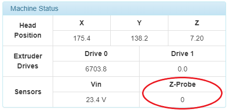

# Z-Probe Calibration

## Calibrating the Limit Switch

To find out the z-offset of the limit switch to the nozzle, follow the steps below. 1. Home the printer again, just to ensure you do not crash the printer throughout this process. 2. Print head to the center of the build plate by sending the command `G1 X200 Y200` 3. Heat up the bed to the preferred printing temperature. You can do this by sending the command `M140 Snnn` where `nnn` is your temperature in °C. You can always look up the recommended bed temperatures for specific materials online. For PLA, a bed temperature of 50°C will work well. For ABS-R, a bed temperature of 60°C is recommended. 4. Wait until the heated bed has reached temperature before continuing. 5. Set the Z-probe offset to 0 by entering the command `G31 G31 P999 X-40 Y28.5 Z0`. This will make it easier to gauge the distance between the Z-probe and the nozzle in the following steps. 6. Run the command `G29 S2`. This clears any active bed leveling compensation. This is **very** important as it will conflict with your updated Z-probe offset and induce a 0.1 - 0.3mm error depending on the magnitude of your bed leveling compensation at that point. 7. Deploy your Z-probe 8. Check whether the Z-probe is functioning correctly. This is a great step to perform before using your Z-probe in order to prevent crashes. Press your Z-probe limit switch and observe the change in value from 0 to 1000 in the Duet Web Console _Machine Status_ table in the _Z-Probe_ box. If the value does not change the Z-probe is wired or configured wrong, do not continue to the next step!

1. Move the bed towards the nozzle by sending the command `G1 Z20`. When you send the command `G30` the bed will move slowly and precisely to the Z-probe, if you send `G30` while the bed is at `Z100` or greater you will have to wait for a long time for the Z-probe to trigger.
2. Run the command `G30`. This will move the bed toward the z-probe until the limit switch triggers.
3. Now your Z0 is set to your Z-probe limit switches trigger height. This is because the Z-probe limit switch offset is 0mm. Now that we have set our Z0 to the trigger height we can move the bed toward the nozzle in order to find the distance between the trigger height of the Z-probe and the nozzle!
4. Retract the Z-probe.
5. Jog the bed up slowly toward the nozzle using the negative Z buttons in _Machine Control_ on the Duet Web Console. Read the next step!

   

6. As you are moving the bed up towards the nozzle you will encounter an axis limit. These axes limits are set for the X, Y and Z axes and will stop you from moving past a certain coordinate. This will make it harder to crash the printer. However, in this case we know what we are doing so we can disable the axes limits. Send the command `M564 S0` to disable the axis limits. To learn more about this command visit the [RepRap G-code wiki](https://reprap.org/wiki/G-code#M564:_Limit_axes).
7. **Be careful when moving the bed close to the nozzle. Use the 1mm and 0.1mm buttons.** Determining when the bed is touching the nozzle can be difficult. You might have to heat up the nozzle as you learned before in order to ensure that none of the filament from the hot-end gets in the way. Using a piece of paper to determine when the nozzle is touching the bed is also helpful. Grab a sticky-note or small piece of paper and place it under the nozzle. Then carefully jog the bed into the nozzle, move the paper back and forth. When you feel the nozzle grab the paper your nozzle is touching the bed!. 
8. Record the Z-value that the printer is currently displaying in _Machine Status_. The absolute \(non-negative\) of this value is your Z-probe offset. It might be a good idea to write down this value.
9. Enter the command `G31 P999 X-40 Y28.5 Znnn` where `nnn` is your Z-probe offset.
10. Move the bed away from the nozzle `G1 Z20`.
11. Deploy your Z-probe!
12. Send the command `G30`.
13. Move the bed back up to the nozzle as described in the steps above. Your Z value should be 0 when the bed is touching the nozzle. If it is not you might need to tune the Z-probe offset or repeat the process.
14. In order for these changes to take effect permenantly, you will have to open up your _config.g_ file and update the Z-offset of this command there. If you have the newer version of the SD card, you will have to find _machine\_zprobe.g_ and open that instead.
15. Find the uncommented `G31` command and change the `Z` parameter value to the value you just found.
16. Save the file, now if you reboot your Duet the Z-probe offset will be saved. If you ever make a mechanical change to the printer, skip the bed and so on, you will have to recalibrate your Z-probe following the steps above.

Continue on to the [Preparing a Print](http://promega.printm3d.com/books/user-manual/page/preparing-a-print) guide, the next chapter in the [Getting Started](http://promega.printm3d.com/books/user-manual/chapter/getting-started) guide.

